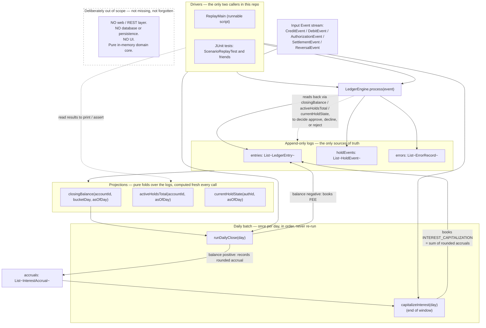
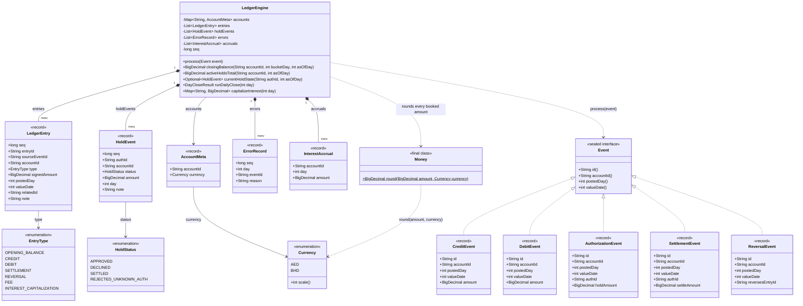
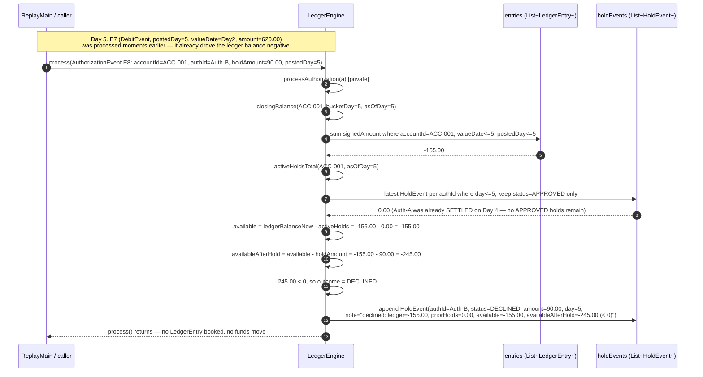
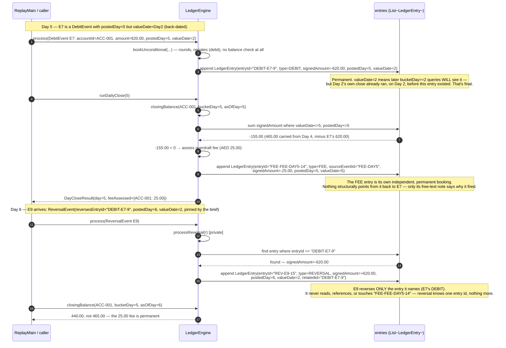

# Architecture — HLD, LLD, and a study guide

This is a companion to the existing docs (`README.md`, `NUMBERS.md`,
`AMBIGUITIES.md`, `REJECTED.md`, `docs/architecture-tradeoffs.md`) — those
files are the authoritative record of *what was decided and why*. This file
is a different kind of artifact: **diagrams first, prose second**, written so
you can look at a picture, say the explanation out loud, and check yourself
against the narration underneath it. It exists to help you (Kazim) walk into
a 45-minute live defense of this codebase and explain it from memory, without
re-reading the source under pressure.

Every diagram below is a Mermaid diagram, in a fenced `mermaid` code block.
GitHub renders these natively on the repo page — no image files, no external
tools.

---

## 1. Plain-English overview

This project is a tiny simulation of the part of a bank's core system that
answers one question, over and over: **"what happened to this account's
money, and when did we find out about it?"** It is not a bank app — there is
no web server, no database, no UI. It is a single Java class
(`LedgerEngine`) that you feed a stream of events (credits, debits,
card-authorization holds, settlements, reversals), one at a time, in the
order they actually happened, and it keeps a running, queryable record.

**Why event-sourced / append-only.** The brief's non-negotiable rule is that
nothing is ever mutated or deleted — every fact, once recorded, stays
recorded forever, and corrections happen by adding a *new* fact that offsets
an old one, never by editing the old one. This isn't just a style
preference: it's what makes the system auditable and what makes "what did we
know back then?" a well-defined, answerable question instead of something
that got silently overwritten. Three plain Java lists are the entire
database: `entries` (every booked money movement), `holdEvents` (every
authorization-hold lifecycle event), `errors` (every rejected input). Nothing
else is a source of truth — balances, hold status, "is this account
overdrawn" are all just *computed by reading through those lists*, fresh,
every time you ask.

**The one big idea.** Real events don't always arrive in the order they took
effect. A debit can be *entered* on Day 5 but *belong to* Day 2 (imagine a
merchant batching up card transactions and settling them late). So every
ledger entry actually carries two dates: `postedDay` (when it entered the
ledger — physical time) and `valueDate` (which accounting day it affects —
effective time). Once you accept that those two dates can differ, "the
closing balance for Day 2" stops being one number and becomes a *question
with a hidden second parameter*: do you mean "what Day 2 looked like at the
time, using only what had been entered by then" (this is final, and it's
what a fee-assessment batch must use — you cannot legally go back and charge
a fee for a day that has already closed), or do you mean "what Day 2 looks
like now, with the benefit of hindsight, including that late-arriving
debit" (this is what a retrospective report should show)? Both questions are
real, both are needed, and one number can't answer both. That's why
`closingBalance` takes **two** day arguments —
`closingBalance(accountId, bucketDay, asOfDay)` — instead of one: `bucketDay`
picks the accounting bucket (filter by `valueDate <= bucketDay`), `asOfDay`
picks how much of the ledger existed yet (filter by `postedDay <= asOfDay`).
Daily fee/interest assessment always asks with `bucketDay == asOfDay ==
today`; retrospective reports ask with `bucketDay < asOfDay`. Same formula,
two different, equally legitimate answers, depending on which question you
actually mean. Once this clicks, almost every "surprising" number in the
scenario (the fee landing on Day 5 instead of Day 2, the reversal not
un-doing the fee) stops being surprising — it's the same idea applied
consistently.

---

## 2. HLD — High-Level Design

**What this shows, in words:** events flow in one direction into
`LedgerEngine.process()`, which is the *only* place any of the three
append-only logs ever get written to. Everything in the "Projections" box —
`closingBalance`, `activeHoldsTotal`, `currentHoldState` — is a **read-only
fold** over those logs; nothing is a cached field that could go stale or get
out of sync. Notice the dashed loop back from the logs into `process()`:
when an `AuthorizationEvent` or `SettlementEvent` comes in, the engine has
to read its *own* logs (via those same projection functions) before it can
decide what to append — that loop is the event-sourcing pattern itself
("derive current truth by folding the log"), not a mistake in the diagram.
The "Daily batch" box (`runDailyClose`, `capitalizeInterest`) is a separate
layer that runs *after* a day's events are all processed, and only ever
moves forward in time. `ReplayMain` and the JUnit tests are the only two
callers of any of this in the whole repository — and, as the dashed box
makes explicit, there is deliberately no web layer, database, or UI anywhere
in scope; this is a pure domain core, on purpose.

---

## 3. LLD — Low-Level Design

### 3a. Class diagram — the real core types

**What this shows, in words:** `Event` is a `sealed interface` — Java (and
the compiler) guarantee those five records are the *only* kinds of event
that can ever exist, which is exactly why `LedgerEngine.process()`'s
`switch` over `Event` needs no `default` case. Every record is immutable by
construction (that's what `record` means) — there is no setter anywhere in
this diagram. `LedgerEntry` and `HoldEvent` both carry a `seq`: this is a
single counter shared across *all three* logs (entries, hold events, *and*
errors) — it's one global append-order timeline across the whole engine, not
three independent per-log counters. `LedgerEngine` itself holds no other
mutable state beyond those four lists, the `accounts` map, and `seq` — every
public read method (`closingBalance`, `activeHoldsTotal`, `currentHoldState`)
is a pure function of those lists and its arguments, computed fresh on every
call.

### 3b. Sequence diagram — Authorization request → approve or decline (the real Auth‑B case)

This walks through the actual Auth-B outcome from the scenario: **declined**,
because by the time it's requested (Day 5), the account is already
overdrawn from E7 (a back-dated debit) — not merely "unsettled."

**What this shows, in words:** approving or declining a hold is decided
*once*, synchronously, at the moment the `AuthorizationEvent` is processed —
there's no "pending" state that gets revisited later. The decision rule is
literally `ledgerBalance − activeHolds − newHoldAmount >= 0`. In this case
`activeHolds` is **0.00** (Auth-A had already been fully settled on Day 4),
so the decline is driven entirely by the ledger balance already being
negative — from E7, a plain back-dated `DebitEvent` that was allowed to post
unconditionally and drive the account negative (only authorizations are
gated by an available-balance check; plain credits/debits/settlements never
are). The decline itself is appended as a normal, permanent `HoldEvent` — not
an error, not a retry, not a "still pending" placeholder.

### 3c. Sequence diagram — the Day‑5 overdraft fee that E9's reversal never undoes

This is the single trickiest thing to explain live: a back-dated debit
(E7) causes a fee days after its own value date, and a later reversal of
that debit (E9) does **not** claw the fee back — because reversal targets
one named entry, never that entry's downstream consequences.

**What this shows, in words:** two separate, unrelated design rules combine
to produce this result, and both are visible above. First, `runDailyClose`
only ever uses *today's* view of the world (`bucketDay == asOfDay == today`)
and is never re-run — so Day 2's close, having already happened on Day 2
with a positive balance, is untouchable; the fee can only fire on the day
E7 actually posts and is discovered, which is **Day 5**, not Day 2 (this is
exactly why acceptance criterion 2, "fee assessed on Day 2," is rejected in
`REJECTED.md`). Second, `processReversal` takes an `entryId` — one specific,
already-booked entry — finds it, and books a single offsetting entry for
*that entry's exact amount*. It has no notion of "and also undo whatever
this caused." So E9 perfectly cancels E7 itself (both share `valueDate=2`,
so a Day-2 retrospective query does return cleanly to 250.00), but the fee
that E7's temporary negative balance triggered on Day 5 is a completely
separate, independent `LedgerEntry` that E9 never references and never
touches — the balance carried forward from Day 4 onward is short by exactly
that 25.00, permanently (this is exactly why criterion 6, "all balances
return to their pre-E7 values after E9," is rejected in `REJECTED.md`).

---

## 4. How to explain this in 60 seconds

Re-read this section five minutes before you walk in — not the whole file.

- **The two-day-parameter balance function exists because "closing balance
  for day D" is not one number.** `closingBalance(accountId, bucketDay,
  asOfDay)` separates "which accounting bucket" (`bucketDay`, filters by
  `valueDate`) from "how much of the ledger existed yet" (`asOfDay`, filters
  by `postedDay`). Daily batches use `bucketDay == asOfDay == today` and
  never look back; retrospective reports use `bucketDay < asOfDay`.
- **The fee lands on Day 5, not Day 2**, because fee assessment is a
  one-shot batch that runs once per day, in order, using only what's posted
  so far — and never re-opens a day that already closed. E7 (the debit that
  causes the overdraft) doesn't exist yet on Day 2; it posts on Day 5, so
  that's when the check that finds a negative balance actually runs.
- **Auth-B is declined, not just "unsettled,"** because by the time it's
  requested (Day 5, after E7 has posted), the ledger is already at
  −155.00 with zero active holds — adding a 90.00 hold would push available
  balance to −245.00, which fails the non-negotiable authorization rule
  outright. "Never settled" would imply it was at least approved first; it
  wasn't.
- **E9 doesn't undo the fee** because a reversal targets one specific,
  named ledger entry (here, E7's debit) and books one offsetting entry for
  it — it has no concept of "and everything this caused." The fee is its
  own independent, permanent entry with no structural link back to E7.
- **The BHD instalments can't all be 3.334** because `3.334 × 3 = 10.002 ≠
  10.000` — it's arithmetic, not a judgment call. `10.000 / 3` isn't exact
  at 3 decimal places, so one instalment has to absorb a 0.001 remainder;
  we floor all three to 3.333 and give the leftover to the last one
  (3.333 / 3.333 / 3.334).
- **The capitalized interest total is the *sum of the already-rounded* daily
  accruals** — never an independent re-rounding of the raw sum — because
  that's the only definition that satisfies "rounded daily accruals must
  sum exactly to the capitalized total" *by construction*, not by luck.
